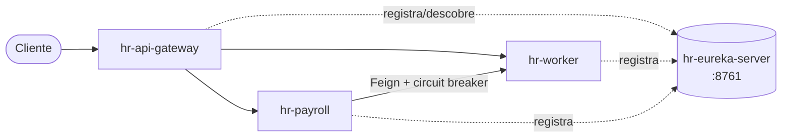

# Wallet API

Projeto de estudo em arquitetura de **microserviços** com Java 21 + Spring Boot / Spring Cloud,
organizado como **monorepo** (cada serviço em uma subpasta).

## Status das builds (CI)

[](https://github.com/BrunodevBandeira/wallet-api/actions/workflows/hr-eureka-server-ci.yml)
[](https://github.com/BrunodevBandeira/wallet-api/actions/workflows/hr-api-gateway-ci.yml)
[](https://github.com/BrunodevBandeira/wallet-api/actions/workflows/hr-worker-ci.yml)
[](https://github.com/BrunodevBandeira/wallet-api/actions/workflows/hr-payroll-ci.yml)

## Arquitetura



- **Service discovery:** todos os serviços se registram no `hr-eureka-server` e se encontram **pelo nome** (não por IP/porta fixos).
- **Comunicação:** o `hr-payroll` consome o `hr-worker` via **OpenFeign**, protegido por **circuit breaker** (Resilience4j) — se o worker cair, entra um *fallback*.

## Serviços

| Serviço | Porta | Papel | Status |
|---------|-------|-------|--------|
| [`hr-eureka-server`](./hr-eureka-server) | `8761` | Service discovery (Eureka Server) | ✅ funcional |
| [`hr-worker`](./hr-worker) | dinâmica (`${PORT:0}`) | Cadastro de workers e cálculo de renda diária | 🚧 em desenvolvimento |
| [`hr-payroll`](./hr-payroll) | `8082` | Cálculo de pagamento; consome o `hr-worker` via Feign | 🚧 em desenvolvimento |
| [`hr-api-gateway`](./hr-api-gateway) | `8080` | Porta de entrada única (roteamento) | 🚧 em construção |

## Stack

- **Java 21** + **Spring Boot 4.1**
- **Spring Cloud:** Netflix Eureka, OpenFeign, Circuit Breaker (Resilience4j)
- **Persistência:** Spring Data JPA + H2 (em memória)
- **Utilitários:** Lombok, MapStruct
- **Build:** Maven (wrapper incluído: `./mvnw`)

## CI (GitHub Actions)

Cada serviço tem seu próprio workflow em [`.github/workflows/`](./.github/workflows). Com **path filters**,
um `push` roda **apenas a CI do serviço que mudou** — mantendo os serviços independentes.
Cada CI compila e roda os testes (`./mvnw -B verify`) em Java 21.

## Como rodar localmente

> ⚠️ Suba o **Eureka primeiro** — os outros serviços se registram nele ao iniciar.

```bash
# 1) service discovery
cd hr-eureka-server && ./mvnw spring-boot:run

# 2) demais serviços (cada um em um terminal)
cd hr-worker  && ./mvnw spring-boot:run
cd hr-payroll && ./mvnw spring-boot:run
cd hr-api-gateway && ./mvnw spring-boot:run
```

Painel do Eureka: <http://localhost:8761>
